[![Forks][forks-shield]][forks-url]
[![Stargazers][stars-shield]][stars-url]
[![Issues][issues-shield]][issues-url]
[![MIT License][license-shield]][license-url]


<!-- PROJECT LOGO -->
<br />
<p align="center">


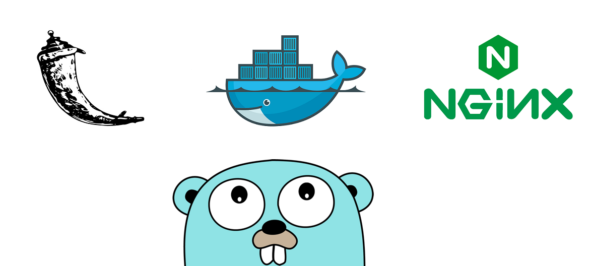
  <h3 align="center">Benchmarking HTTP servers</h3>

  <p align="center">
    Explore performance of Flask and Go servers with ApacheBench like tools.
    <br />
    <a href="https://github.com/marck20/benchmark-http-servers"><strong>Explore the docs »</strong></a>
    <br />
    <br />
    <a href="https://github.com/marck20/benchmark-http-servers/issues">Report Bug</a>
    ·
    <a href="https://github.com/marck20/benchmark-http-servers/issues">Request Feature</a>
  </p>
</p>


<!-- TABLE OF CONTENTS -->
## Table of Contents

* [About the Project](#about-the-project)
  * [Built With](#built-with)
* [Getting Started](#getting-started)
  * [Prerequisites](#prerequisites)
  * [Installation](#installation)
* [Usage](#usage)
  * [Run server containers](#run-server-containers)
  * [Run benchmark containers](#run-benchmark-containers)
* [Server and client implementations](#server-and-client-implementations)
  * [Servers endpoints](#servers-endpoints)
  * [NGINX reverse proxy](#nginx-reverse-proxy)
  * [Go httpserver](#go-httpserver)
  * [Goab clients](#goab-clients)
  * [Goab channel](#goab-channel)
  * [Goab mutex](#goab-mutex)
  * [Goab workerpool](#goab-workerpool)
* [Benchmarks](#benchmarks)
  * [Flask server benchmark](#flask-server-benchmark)
  * [Go server benchmarks](#go-server-benchmarks)
* [Known problems](#known-problems)
* [Future plans](#future-plans)
* [License](#license)
* [Useful resources](#useful-resources)
* [Contact](#contact)


<!-- ABOUT THE PROJECT -->
## About the project

The main goal of this project was to develop a Go version of ApacheBench implementing `-n`, `-c` and `-k` flags, as well as benchmarking several clients against Flask and Go http servers tweaking settings with the mentioned flags to find the best configuration.

This project was proposed during a job interview as an exercise to get an intern position. However, exploring and developing the multipe solutions in this repository helped me out to better undersand key aspects of Go language such as empty structs, goroutines, channels, or workerpool model.

I really hope this repository can bring knowledge to others on the topic. Therefore, this document will contain some clarifications besides some useful link resources.

### Built with

In order to preserve your current system state, to easily run benchmarks and to test different approaches, we will be using Docker containers. Further depenedencies like NGINX, Flask or Go will be downloaded and installed within corresponding Docker images when running Dockerfiles.

* [Docker](https://www.docker.com/)


<!-- GETTING STARTED -->
## Getting started

This section covers the installation of Docker and a basic usage of the different containers.

### Prerequisites

* Docker

Docker will help us to run multiple isolated containers which can be easily removed and build. 

You can check if Docker is already installed the following way:
```sh
docker -v
```

To install Docker you can use:
```sh
sudo apt-get update
wget -qO- https://get.docker.com/ | sh
sudo usermod -aG docker $(whoami)
newgrp docker
```

Verfy installation:
```sh
docker run hello-world
```

### Installation

Clone this repo on current local directory:
```sh
git clone https://github.com/your_username_/Project-Name.git
```
Create Docker network.  If you use another network's name, you have to make corresponding the changes to `run.sh` script of each container directory.
```sh
docker network create my-network
```

<!-- USAGE EXAMPLES -->
## Usage

The different containers are divided into two main categories: two http servers and five benchmark clients. Each of these directories contain a Dockerfile to build the corresponding image and a run.sh script to run containers more easily.


First of all, I would suggest you to run `chmod.sh` to enable execution permission on each script.
```sh
chmod +x build.sh
```

On the root of the repo you can find a `build.sh` script to build all Docker images.
```sh
./build.sh
```

### Run server containers

To run httpserver, Flask or NGINX servers you can use the corresponding `run.sh` script.

Run Flask server:
```sh
./flask/run.sh
```

### Run benchmark containers

On each benchmark container directory you will find a `run.sh` as well, but this time received flag arguments like `-u` are passed to the Docker container. 

Run ab benchmark executing 200000 requests running on 8 concurrent workers and using Keep-Alive header against Flask `/time` endpoint:
```sh
./ab/run.sh -n 200000 -c 8 -k http://flask:5000/time
```

Run goab_benchmark executing 500000 requests running on 48 concurrent works against Flask `/greet` endpoint through NGINX reverse proxy:
```sh
./goab/mutex/run.sh -n 500000 -c 48 -k -u http://nginx:80/
```
Caution: goab benchmarks use `-u` flag to introduce target URL.


## Server and client implementations

### Servers endpoints

Each Flask and Go httpserver expose three basic RESTful endpoints

1. `/greet`: most simple endpoint which responds with a greeting JSON answer like the following:

```sh
$curl http://127.0.0.1:8080/greet
{
    "Message": "Hello!"
}
```

2. `/time`: this endpoint returns the current system time in a JSON answer like the following:

```sh
$curl http://127.0.0.1:5000/time
{
    "time": "07/06/2020, 00:29:17"
}
```

3. `/user`: simulates an api which queries to a users' DB. This endpoint expects an `id` parameter with a userID value and returns a JSON message like the following: 

```sh
$curl http://127.0.0.1:5000/user?id=1
{
    "ID": 1,
    "Name": "admin",
    "Role": "admin"
}
```


### NGINX reverse proxy

Although we don't really need NGINX, having multiple apis distributed in different containers is a common practice on microservices and I wanted to simulate a similar environment. We will be using the `proxy_pass` feature of NGINX to route all  `/` requests to `/greet` endpoint on `flask` container.

To achieve our goal, this container will be using a configuration file named `default.conf` where we configured the redirect behaviour.

```sh
location / {
    proxy_pass http://flask:5000/greet;
    container hostname
}
```


### Go httpserver

This Go server uses fasthttp package instead of net/http. Fasthttp uses a worker pool model which is a zero allocation model, hence has a better performance.


### Goab clients

When I was implementing the first version of my goab benchmark client, I found several useful online resources that offered different solutions. Thus, I decided to implement different versions of my goab client while exploring the different approaches. 


#### Goab channel

Goab channel approach relies on buffer channels for returning results from workers. 

The next line initializes a buffer channel of `cFlag` size. Therefore, the main function must be constantly reading from results channel.

```sh
results = make(chan int64, *cFlag)
```

Each worker returns its latency through result channel.

```sh
if err == nil {
  results <- elapsed
}
```

#### Goab mutex

Goab mutex approach uses global variables which are modified by each goroutine. In order to avoid problematic conditions like data races, this solution uses a mutual exclusion model.

```sh
if err == nil { //Mutual exclusion segment
		mu.Lock()
		success++
		sumLatency += elapsed
		if elapsed > maxLatency || first {
			maxLatency = elapsed
		}
		if elapsed < minLatency || first {
			minLatency = elapsed
		}
		if first {
			first = false
		}
		mu.Unlock()
	}
```

#### Goab workerpool

One of the most useful aspects of Go is the use of zero memory models. Both `goab_channel` and `goab_mutex` create a goroutine for every request. Each goroutine requires to allocate memory. In contrast, a pool of workers which recieves empty structs as jobs through a channel just allocates its memory when workers are created.

Create `cFlag` workers:
```sh
for w := 0; w < *cFlag; w++ {
		wg.Add(1) //Increment waitgrupo counter
		go worker(w, &wg)
	}
```

Worker function:
```sh
func worker(id int, wg *sync.WaitGroup) {
	defer wg.Done()
	for _ = range jobs {
		request()
	}
}
```

Create `nFlag` jobs:
```sh
for j := 0; j < *nFlag; j++ {
  jobs <- struct{}{}
}
```

You can find two workpool implementations: `goab/mutex_wp/goab_workerpool_mutex.go` and `goab/channel_wp/goab_workerpool_channel.go`.

<!-- BENCHMARKS -->
## Benchmarks

This section will analyze different benchmark results. The following benchmarks are classified in two main groups: Flask benchmarks and Go benchmarks. All five benchmarks will be executed multiple times against both servers with different settings to find the most optimal configuration.

Results of each benchmark will be represented with two charts: a first chart not using Keep-Alive header (`-k`) and a second chart using Keep-Alive.

### Flask server benchmark

This Flask server has a really slower performance than Go server, about x160 times slower. Therefore, there is no point in running different benchmark clients against Flask. In this case, we will be using `ab` client.

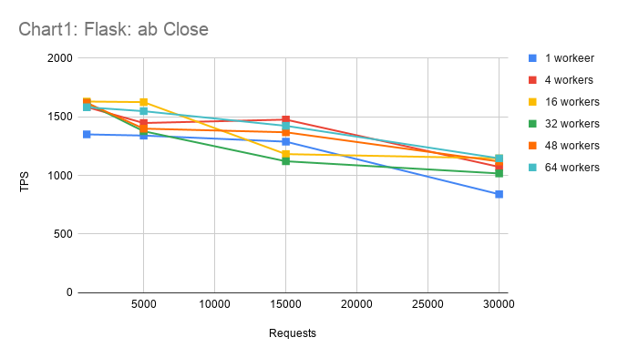
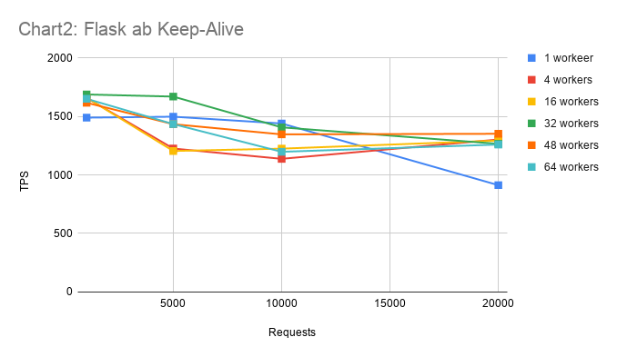

As you can see on Chart1 and Chart2, their performances are quite similar. As we mentioned before, Flask is really slow and in almost every configuration is acting as a bottleneck at 1200 ~ 1500 TPS. Hence, Keep-Alive or concurrency flags don't have  a big impact on performance.

If you set up the NGINX reverse proxy you can also benchmark Flask server using `http://nginx:80/`.

### Go server benchmarks

This Go server implementation is way  faster than Flask server. We will be running multiple benchmarks to test the performance of the server, but also to compare the benchmark client's efficiency.

#### Mutual exclusion

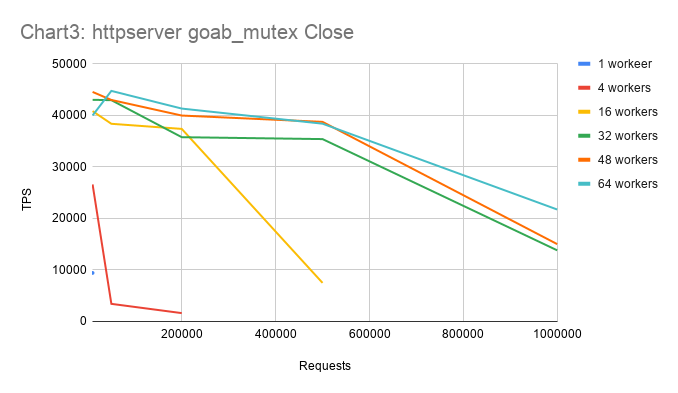
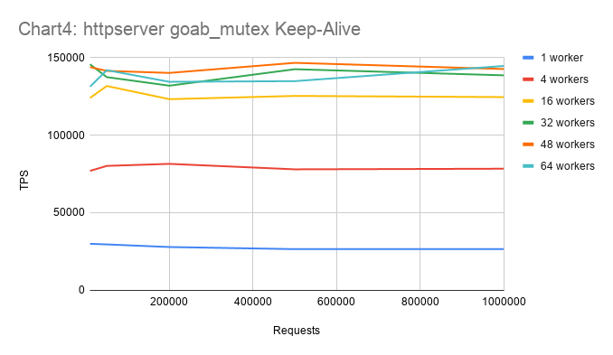
As you can see on chart3 and chart4, benchmarks of 32, 48 and 64 workers obtain similar performances (measured as TPS).

In this case, `-k` flag has a big impact on the benchmark performance. Thus, if we don't use Keep-Alive, a signifcant part of the execution time will be consumed establishing the TCP Three-Way Handshake. If we use the Keep-Alive flag, we obtain a linear performance. In contrast, if we do not use Keep-Alive, performance decreases as requests increase.

#### Channel

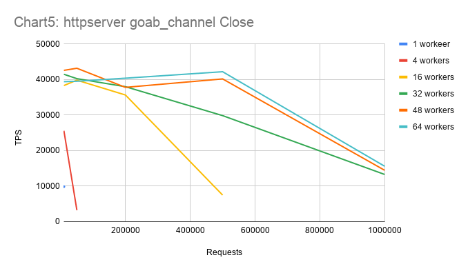
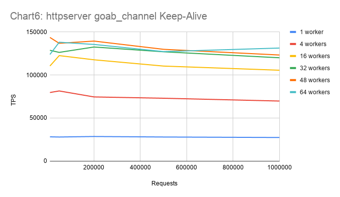

The performance of this benchmark is almost identical to Mutual exclusion benchmark.

#### Workerpool - mutual exclusion

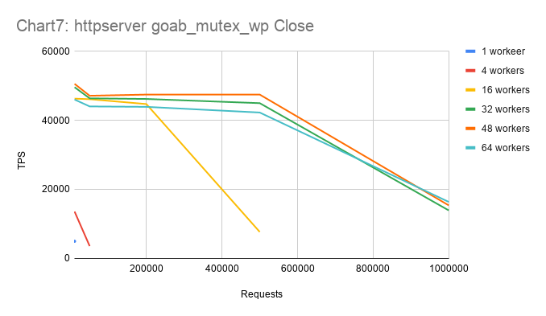
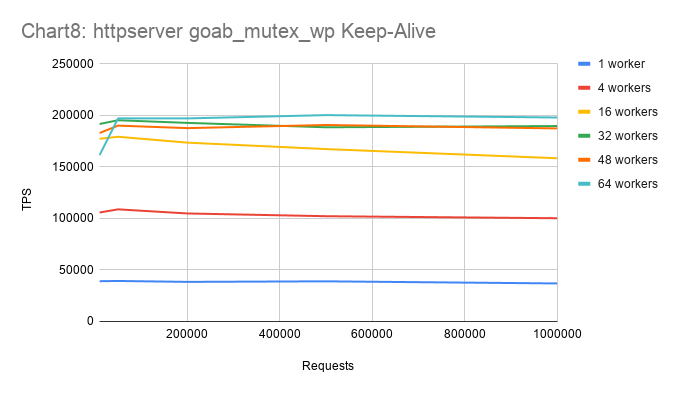

Workerpool benchmarks have the best performance. Using zero memory models on critical Go code is a must.

#### Workerpool - channel

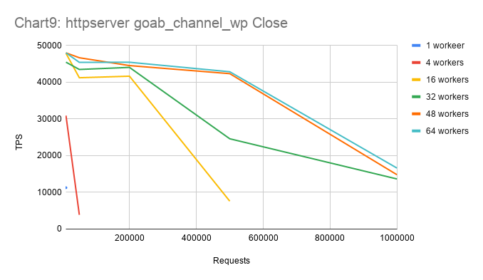
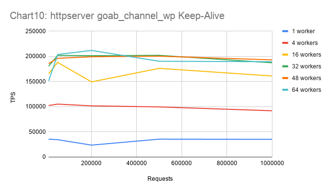


This workpool benchmark performance is similar to the `Workerpool -mutual exclusion` performance.

#### Benchmark conclusions

After analyzing each benchmark, we can conclude that the workerpool model is more efficient rather than allocating a goroutine for each job.

In addition, there is no significant difference in the performance between mutual exclusion and channel approaches.
 
## Known problems

There is some kind of bug when not using  `-k` flag. If we run a goab client like `goab/mutex_wp` with 1 worker and an elevated number of request, those requests often fail with the follwing error message:

```sh
request error:  dial tcp4 172.18.0.3:5000: connect: cannot assign requested address
```

Seems like we are running out of ports.

## Future plans

1. Solve bug mentioned on known problems.

2. Explore deeply other implemented apis like `/user`.

3. Test `-r` flag with NGINX reverse proxy.

<!-- LICENSE -->
## License

Distributed under the MIT License. See `LICENSE` for more information.


## Useful resources

### Fasthttp vs net/http

- https://stackoverflow.com/questions/41627931/why-is-fasthttp-faster-than-net-http
- https://husobee.github.io/golang/fasthttp/2016/06/23/golang-fasthttp.html

### Flask RESTful API

- https://flask-restful.readthedocs.io/en/latest/quickstart.html#a-minimal-api
- https://www.codementor.io/@sagaragarwal94/building-a-basic-restful-api-in-python-58k02xsiq
- https://medium.com/@doedotdev/docker-flask-a-simple-tutorial-bbcb2f4110b5

### Go concurrency

- https://golangbot.com/buffered-channels-worker-pools/
- https://eli.thegreenplace.net/2019/on-concurrency-in-go-http-servers/
- https://godoc.org/github.com/valyala/fasthttp
- https://brandur.org/go-worker-pool
- https://github.com/parkghost/gohttpbench

### NGINX reverse proxy

- https://www.docker.com/blog/tips-for-deploying-nginx-official-image-with-docker/
- https://dzone.com/articles/configuring-nginx-to-proxy-rest-requests-across-mu

<!-- CONTACT -->
## Contact

Marc Pons - marc.pons.bonnin@est.fib.upc.edu.com

Project Link: [https://github.com/your_username/repo_name](https://github.com/your_username/repo_name)


<!-- MARKDOWN LINKS & IMAGES -->
<!-- https://www.markdownguide.org/basic-syntax/#reference-style-links -->


[forks-shield]: https://img.shields.io/github/forks/marck20/benchmark-http-servers.svg?style=flat-square
[forks-url]: https://github.com/marck20/benchmark-http-servers/network/members
[stars-shield]: https://img.shields.io/github/stars/marck20/benchmark-http-servers.svg?style=flat-square
[stars-url]: https://github.com/marck20/benchmark-http-servers/stargazers
[issues-shield]: https://img.shields.io/github/issues/marck20/benchmark-http-servers.svg?style=flat-square
[issues-url]: https://github.com/marck20/benchmark-http-servers/issues
[license-shield]: https://img.shields.io/github/license/marck20/benchmark-http-servers.svg?style=flat-square
[license-url]: https://github.com/marck20/benchmark-http-servers/blob/master/LICENSE.txt